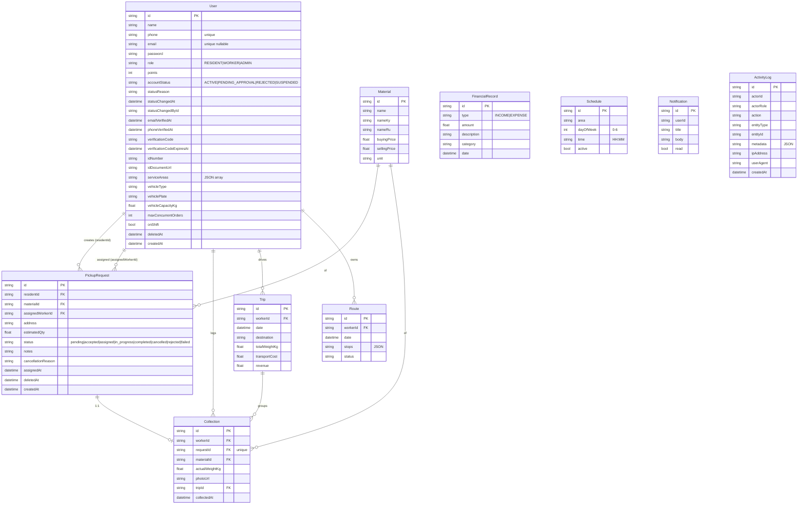

# Eko Naryn — Project Report

## 1. Executive Summary

Eko Naryn is a full-stack platform for a small recyclable-collection business in Naryn, Kyrgyzstan. It serves three user roles — Residents (who book pickups), Workers (who collect material on-site and log it), and Admins (who approve workers, assign orders, and view analytics) — across four surfaces: a public marketing/request website, an admin dashboard, a native Android app, and a single REST API backed by Prisma + SQLite.

The codebase is a Turborepo monorepo (~13.5k LOC of source across TS/TSX/Java/XML/Prisma/SQL) with a tight, layered architecture: one Express service, one Prisma schema, one shared TS package consumed by all web surfaces. Most of the business logic — auth, lifecycle state machine, assignment guardrails, audit logging — lives in `packages/api`.

State is **active early-stage development**. Git history shows only five commits since the initial commit, the most recent two adding bilingual support, the native Android app, and a worker-approval / order-lifecycle / activity-log overhaul. There is no CI, no production deployment artifact beyond a single `Dockerfile`, and the database is SQLite; the README still describes Postgres and Expo/React Native, neither of which matches the current code (see §13).

---

## 2. Tech Stack

**Languages**

- TypeScript 5.3 (root `tsconfig.json:3` targets ES2020, strict on)
- Java 11 (mobile, Android `compileSdk 34`, `minSdk 26` — `apps/mobile/app/build.gradle:9-15`)

**Frameworks & runtime**

- **API:** Express 4.18 on Node ≥18 (`packages/api/package.json:14-24`, `packages/api/src/app.ts`)
- **Web (Dashboard + Website):** Next.js 14.1 (App Router, RSC + client components) + Tailwind 3.4
- **Mobile:** Native Android in Java with AndroidX (AppCompat, ConstraintLayout, RecyclerView, SwipeRefresh, Material 1.11). **Not** React Native/Expo despite the README.
- **ORM:** Prisma 5.10/5.22 over **SQLite** (`packages/db/prisma/schema.prisma:5-8`, file at `packages/db/prisma/dev.db`). The committed `docker-compose.yml` and several `.env.example` files still reference Postgres — the actual schema provider is sqlite.

**Key libraries**
| Library | Where | Purpose |
|---|---|---|
| `@prisma/client` 5.22 | api, db | DB access, generated types |
| `jsonwebtoken` 9 | api | Access + refresh JWTs |
| `bcryptjs` 2 | api, db | Password hashing |
| `zod` 3.22 | api, shared, dashboard, website | Request validation + shared input schemas |
| `multer` 1.4 | api | File uploads (collection photos, ID documents) |
| `helmet`, `cors`, `morgan` | api | Standard Express hardening + logging |
| `@tanstack/react-table` 8 | dashboard | Tables (`requests`, `workers`, `residents`, …) |
| `recharts` 2.12 | dashboard | Bar/pie charts on overview & analytics |
| `react-hook-form` + `@hookform/resolvers` | dashboard, website | Form state & zod resolvers |
| `lucide-react` | dashboard, website | Icon set |
| `okhttp` 4.12 + `gson` 2.10 | mobile | HTTP + JSON |
| `androidx.security:security-crypto` 1.1.0-alpha06 | mobile | `EncryptedSharedPreferences` for token storage |
| `jest` 29 + `ts-jest` + `supertest` 7 | api | Test framework (recently added; only suite is `tests/workerLifecycle.test.ts`) |

**Build / package management**

- npm 11 workspaces (`package.json:5-8`) + Turborepo 2.3 (`turbo.json`).
- Mobile: Gradle 8.x, AGP 8.2.2 (`apps/mobile/build.gradle:3`).
- Prisma migrations (`packages/db/prisma/migrations/`).

**Deployment target (declared, not necessarily realized)**

- A single Dockerfile builds the API for Node 20 alpine (`packages/api/Dockerfile`). `docker-compose.yml` declares Postgres + pgAdmin + API but the schema is SQLite — the compose Postgres service is dead config until the schema's provider changes.

---

## 3. Repository Layout

```
ekonarynproject/
├── apps/
│   ├── website/       Public Next.js 14 marketing + request site (port 3000)
│   ├── dashboard/     Admin Next.js 14 SPA-in-app-router (port 3001)
│   └── mobile/        Native Android Java app (Gradle, OkHttp/Gson)
├── packages/
│   ├── api/           Express REST API (port 4000) — all business logic
│   ├── db/            Prisma schema, migrations, seed, and PrismaClient singleton
│   └── shared/        TS types, Zod schemas, role/status enums, color/area constants
├── docker-compose.yml Postgres + pgAdmin + API (Postgres service unused; see §13)
├── turbo.json         Turbo task graph (build, dev persistent, db:* uncached)
├── .env.example       Root env template (Postgres URL — stale)
├── tsconfig.json      Strict TS base config inherited by every package
├── .eslintrc.json     ESLint flat config: typescript-eslint recommended
└── README.md          Mostly accurate but lists Postgres/Expo (see §13)
```

Notable subtrees:

```
packages/api/src/
├── app.ts             Express bootstrap (helmet, cors, morgan, json, /uploads static, error handler)
├── index.ts           Server listen wrapper
├── middleware/
│   ├── auth.ts        JWT verify + role check + DB-backed account-status check
│   ├── validate.ts    Zod-to-Express middleware
│   └── error.ts       AppError class + error handler
├── services/
│   ├── activityLog.ts Append-only audit-log writer (swallows failures)
│   └── orderState.ts  Order lifecycle transition table + assertTransition
├── utils/
│   ├── tokens.ts      JWT sign/verify
│   ├── upload.ts      Multer disk storage (10MB, jpg/png/webp)
│   └── verification.ts In-app 6-digit phone-verification codes (no SMS provider)
└── routes/            12 modules: auth, users, materials, requests, collections,
                       trips, routesPlanner, financial, analytics, schedule, activity, index

packages/db/prisma/
├── schema.prisma      10 models (User, Material, PickupRequest, Collection, Trip,
│                      Route, FinancialRecord, Schedule, Notification, ActivityLog)
├── seed.ts            ~480 LOC of realistic Naryn-flavored seed data
└── migrations/
    ├── 20260305192026_init/                       (legacy, uppercase statuses)
    └── 20260508_add_worker_lifecycle_and_activity_log/  (worker fields, ActivityLog,
                                                          status downcasing data fix)

apps/mobile/app/src/main/java/kg/ekonaryn/app/
├── EkoApp.java, MainActivity.java, LocaleHelper.java   App-wide singletons + i18n wrapping
├── auth/    LoginActivity, RegisterActivity, AuthManager (EncryptedSharedPreferences)
├── api/     ApiClient (OkHttp/Gson), Async, ApiException, models/*
├── resident/  ResidentMainActivity + 5 fragments (Home, Request, History, Schedule, Profile)
├── worker/    WorkerMainActivity + 4 fragments (Today, Collect, MyCollections, Profile)
├── admin/     AdminMainActivity + 4 fragments + PendingWorkersActivity
└── ui/      Adapters (RecyclerView) and a Localized helper

apps/dashboard/src/
├── app/                 Next.js App Router pages — 16 pages (see §7)
├── components/          DashboardLayout, Sidebar, ui/{DataTable, PageHeader, StatsCard, StatusBadge}
└── lib/                 api, auth (context), hooks (useApi), i18n (custom RU/EN), utils, messages/{ru,en}
```

---

## 4. Architecture

**Style.** Layered service + thin clients. Single Express monolith, single Prisma schema, three independent presentation surfaces (website, dashboard, mobile) all calling the same REST API. Within the API, each route file is a thin controller that talks directly to Prisma; cross-cutting logic (state machine, audit log, multer upload, JWT, validation) is factored into `services/` and `middleware/`.

```mermaid
flowchart LR
  subgraph Clients
    W[Website (Next.js, :3000)]
    D[Dashboard (Next.js, :3001)]
    M[Android App (Java/OkHttp)]
  end

  subgraph Backend["API · Express + TypeScript (:4000)"]
    APP[app.ts: helmet/cors/morgan/json + static /uploads]
    MW[middleware: authenticate + authorize + requireActiveAccount + validate]
    R[routes/*.ts: auth, users, requests, collections, trips, routes,
       financial, analytics, schedule, materials, activity]
    SVC[services: orderState · activityLog]
    UTL[utils: tokens · upload · verification]
  end

  DB[(SQLite via Prisma — packages/db/prisma/dev.db)]
  FS[(Local FS — packages/api/uploads/)]

  W -- fetch /api/v1 --> APP
  D -- fetch /api/v1 --> APP
  M -- OkHttp /api/v1 --> APP

  APP --> MW --> R
  R --> SVC
  R --> UTL
  R --> DB
  UTL --> FS

  Shared[(packages/shared\nzod schemas + enums + types)]
  Shared -. typecheck .-> W
  Shared -. typecheck .-> D
  Shared -. typecheck + runtime validate .-> R
```

**Request flow (resident creates a pickup → worker collects).**

1. Resident registers via `POST /api/v1/auth/register/resident` (`packages/api/src/routes/auth.ts:103`) → `User` row created with `accountStatus="ACTIVE"` and a verification code; access+refresh JWTs returned.
2. `POST /api/v1/requests` (`requests.ts:33`) — passes `authenticate` → `requireActiveAccount` → `authorize('RESIDENT')` → `validate(pickupRequestSchema)` → creates `PickupRequest{status:'pending'}` and writes `request.created` to `ActivityLog`.
3. Admin `POST /api/v1/requests/:id/assign` (`requests.ts:182`) wraps in `prisma.$transaction` and enforces four guardrails (worker `accountStatus==='ACTIVE'`, `onShift`, `count(active orders) < maxConcurrentOrders`, address contains a service area). Optimistic-concurrency is enforced via `updateMany` with a status-equality predicate (`requests.ts:251-260`) so two admins cannot both assign the same row.
4. Worker `POST /api/v1/collections` (`collections.ts:14`) — multipart photo upload via multer → in a transaction it creates `Collection`, drives `pending|assigned|in_progress → completed` through `assertTransition`, increments resident points by `floor(actualWeightKg)`.

**Auth flow.** JWT-based, no session store. Access tokens last 15m, refresh 7d (`utils/tokens.ts:8-15`). Tokens carry `{userId, role, accountStatus}` (`middleware/auth.ts:6`). On every protected request, `authenticate` decodes the JWT and `requireActiveAccount` re-reads the user from DB so a suspension takes effect within seconds (`middleware/auth.ts:48-69`). Login is blocked for any non-ACTIVE worker with a per-status message; both successful and blocked logins write to `ActivityLog` (`auth.ts:269-310`).

**Order lifecycle.** Authoritative table in `services/orderState.ts:7-22`:
`pending → accepted → assigned → in_progress → completed | cancelled | rejected | failed`. Illegal jumps return 409 with the allowed next states listed.

---

## 5. Core Modules

### packages/shared

Thin TypeScript-only package compiled to `dist/`. Exports:

- `types.ts` — `Role`, `AccountStatus`, `OrderStatus`, `RequestStatus` (legacy alias kept for back-compat), `ActivityAction`, plus interfaces for every entity.
- `schemas.ts` — Zod schemas: `registerSchema` (legacy resident), `residentRegisterSchema`, `workerRegisterSchema`, `verifyCodeSchema`, `loginSchema`, `pickupRequestSchema`, `updateRequestStatusSchema` (uses the lifecycle enum), `assignOrderSchema`, `collectionSchema`, `tripSchema`, `routeSchema`, `financialRecordSchema`, `scheduleSchema`, `updateUserSchema`, `rejectWorkerSchema`, `suspendWorkerSchema`, `reactivateWorkerSchema`. Phone is locked to `^\+996\d{9}$` (`schemas.ts:4`).
- `constants.ts` — Brand colors, Kyrgyz/Russian day names, `AREAS_NARYN` (5 area names), API_VERSION/page-size/file-size limits.

### packages/db

Prisma schema + a `prisma` singleton (`packages/db/src/index.ts`) that conditionally overrides the datasource URL when `process.env.DATABASE_URL` is set, so tests can point at a separate SQLite file without disturbing dev.db.

### packages/api

Express service. Notable internals:

- **`middleware/auth.ts`** — `authenticate`, `authorize(...roles)`, **`requireActiveAccount`** (DB-backed status check that runs on every protected handler).
- **`middleware/error.ts`** — Single `AppError` class + `errorHandler`. Unhandled errors are logged and surface as `500 Internal server error`.
- **`middleware/validate.ts`** — Zod schema → 400 with `details: [{field, message}]`.
- **`services/orderState.ts`** — Pure transition table; `assertTransition` throws `AppError` with `409`.
- **`services/activityLog.ts`** — Append-only writer; accepts either an Express `Request` (extracts IP/UA) or a `LogContext`; **swallows failures** so an audit-write outage cannot break a user request (`activityLog.ts:43-49`).
- **`utils/verification.ts`** — 6-digit code, 15-minute TTL, exposed in API responses when `NODE_ENV !== 'production'` (`verification.ts:18-21`) so QA can complete the flow without an SMS provider.
- **`routes/auth.ts`** (383 LOC) — Three register endpoints: legacy `/register`, `/register/resident`, `/register/worker` (multipart with `idDocument` field). `/login` enforces `accountStatus` and emits `auth.login` or `auth.login_blocked`. `/refresh` re-reads the user so a suspended account cannot mint a new access token. `/me` returns the public projection.
- **`routes/users.ts`** (299 LOC) — `GET /users/workers/pending` plus `POST /users/:id/{approve,reject,suspend,reactivate}`. Each transition writes `Notification` + `ActivityLog`, and is gated by the allowed-from set in `transitionWorkerStatus` (`users.ts:55-101`). `DELETE /users/:id` is a soft delete (`deletedAt`).
- **`routes/requests.ts`** (343 LOC) — Lifecycle-validated `PUT /:id/status`, transactional `POST /:id/assign` with the four guardrails listed in §4, scoped visibility (residents see only their own, workers see only what's assigned to them).
- **`routes/collections.ts`** (185 LOC) — Photo upload + atomic state transition + points credit, all in one `prisma.$transaction`.
- **`routes/activity.ts`** (37 LOC) — Admin-only paginated audit reader, filterable by action/entityType/entityId/actorId.
- **`routes/{trips,routesPlanner,financial,analytics,schedule,materials}.ts`** — Smaller CRUD-shaped modules; analytics emits aggregate JSON for the dashboard charts.

### apps/dashboard

Next.js 14 App Router, all pages marked `'use client'` because the app fetches via JWT in localStorage. Shared layout (`components/DashboardLayout.tsx`) renders the sidebar and gates routes on `useAuth`. Custom in-process i18n (`lib/i18n.tsx`) — RU is default, language is persisted in a cookie that is read in `app/layout.tsx:14` to drive `<html lang>` server-side and avoid a hydration mismatch (this is the focus of commit `e1784ab`).

16 pages, summarized in §7. The `requests` page builds the new lifecycle UI: `pending|accepted` rows show "Assign" with an inline worker dropdown that calls `POST /requests/:id/assign`; `assigned`/`in_progress` show role-appropriate transition buttons; cancellation/failure require a `prompt()` reason that's threaded into the `reason` field of the status payload.

### apps/website

Public marketing surface, 7 pages. `/request` (`apps/website/src/app/request/page.tsx`) auto-attempts register first, falls back to login if phone exists, then posts the request — a deliberate UX shortcut. Uses the same custom i18n module pattern as the dashboard.

### apps/mobile

Native Android. Three role-specific Activities each hosting bottom-nav fragments:

- `ResidentMainActivity` — Home / Request / History / Schedule / Profile (5 tabs).
- `WorkerMainActivity` — Today / Collect / MyCollections / Profile (4 tabs).
- `AdminMainActivity` — Overview / Requests / Workers / Profile (4 tabs); a button on the Workers tab opens `PendingWorkersActivity` for the approval queue.

`ApiClient` is a hand-written OkHttp wrapper that envelope-unwraps `{success, data}` and surfaces `error` strings as `ApiException` (`api/ApiClient.java:71-90`). Auth tokens sit in `AuthManager` backed by `EncryptedSharedPreferences` with a fallback to plain prefs if the device keystore is broken (`auth/AuthManager.java:24-44`). Runtime locale switching is handled by `LocaleHelper` (Kyrgyz default `ru`).

---

## 6. Data Model

**Schema management.** Prisma migrations under `packages/db/prisma/migrations/`. Two migrations exist:

1. `20260305192026_init` — original 9 tables; statuses were uppercase (`PENDING`, `ASSIGNED`, …).
2. `20260508_add_worker_lifecycle_and_activity_log` — adds 18 columns to `User`, 4 columns to `PickupRequest`, the new `ActivityLog` table, several indexes, and a data fix that downcases existing `PickupRequest.status` to the new lowercase lifecycle vocabulary.

`migration_lock.toml` pins the provider to `sqlite`. Seed lives in `packages/db/prisma/seed.ts` (1 admin + 4 workers (one `PENDING_APPROVAL`) + 10 residents + 4 materials + 20 requests + 10 collections + 3 trips + 19 financial rows + 8 schedules).



Indexes worth flagging: `User(accountStatus)`, `User(role)`, `PickupRequest(status)`, `PickupRequest(assignedWorkerId)`, `PickupRequest(createdAt)`, `Notification(userId)`, `ActivityLog(createdAt)`, `ActivityLog(entityType, entityId)`, `ActivityLog(actorId)`, `ActivityLog(action)`. `Collection.requestId` is unique (1:1 with `PickupRequest`).

---

## 7. External Interfaces

**HTTP API** — Base `http://localhost:4000/api/v1`. Envelope shape: `{ success, data?, error?, message?, total?, page?, limit? }`.

| Method & path                      | Auth                              | Notes                                                                    |
| ---------------------------------- | --------------------------------- | ------------------------------------------------------------------------ |
| `POST /auth/register`              | public                            | Legacy resident signup, kept for older mobile builds (`auth.ts:62`)      |
| `POST /auth/register/resident`     | public                            | New resident signup                                                      |
| `POST /auth/register/worker`       | public, multipart                 | `idDocument` file required; creates `PENDING_APPROVAL` worker            |
| `POST /auth/verify`                | public                            | Submit 6-digit code                                                      |
| `POST /auth/verify/resend`         | public                            | Regenerate code                                                          |
| `POST /auth/login`                 | public                            | Blocks non-ACTIVE workers with per-status message                        |
| `POST /auth/refresh`               | public (refresh token)            | Re-checks status before reissuing                                        |
| `GET  /auth/me`                    | bearer                            | Current user public projection                                           |
| `GET  /users`                      | admin                             | Filter by `role`, `accountStatus`, `search`; soft-deleted users excluded |
| `GET  /users/workers/pending`      | admin                             | Approval queue                                                           |
| `GET  /users/:id`                  | self or admin                     |                                                                          |
| `PUT  /users/:id`                  | self (limited) or admin           | Admin-only fields gated server-side                                      |
| `DELETE /users/:id`                | admin                             | Soft delete                                                              |
| `POST /users/:id/approve`          | admin                             | `PENDING_APPROVAL`/`SUSPENDED` → `ACTIVE`                                |
| `POST /users/:id/reject`           | admin                             | `PENDING_APPROVAL` → `REJECTED`, requires `reason`                       |
| `POST /users/:id/suspend`          | admin                             | `ACTIVE` → `SUSPENDED`, requires `reason`                                |
| `POST /users/:id/reactivate`       | admin                             | `SUSPENDED` → `ACTIVE`                                                   |
| `GET  /materials`                  | public                            |                                                                          |
| `POST /materials`                  | admin                             |                                                                          |
| `PUT  /materials/:id`              | admin                             |                                                                          |
| `DELETE /materials/:id`            | admin                             | Hard delete                                                              |
| `POST /requests`                   | active resident                   | `request.created` log                                                    |
| `GET  /requests`                   | active any                        | Resident sees own; worker sees assigned-to-self; admin sees all          |
| `GET  /requests/:id`               | active any                        | Same scoping                                                             |
| `PUT  /requests/:id/status`        | active admin or worker            | Lifecycle-validated; `reason` required for terminal states               |
| `POST /requests/:id/assign`        | active admin                      | Transactional, four guardrails (§4)                                      |
| `DELETE /requests/:id`             | resident (own pending) or admin   | Soft delete                                                              |
| `POST /collections`                | active worker or admin, multipart | `photo` field optional, transitions request to `completed`               |
| `GET  /collections`                | active worker (own) or admin      |                                                                          |
| `GET  /collections/:id`            | scoped                            |                                                                          |
| `PUT  /collections/:id`            | active worker (own) or admin      |                                                                          |
| `POST /trips`                      | admin or worker                   | Optional `collectionIds` link                                            |
| `GET  /trips` / `:id` / `PUT :id`  | admin or worker                   |                                                                          |
| `POST /routes`                     | admin                             |                                                                          |
| `GET  /routes` / `:id` / `PUT :id` | scoped                            | Worker sees own                                                          |
| `POST /financial`                  | admin                             |                                                                          |
| `GET  /financial`                  | admin                             | Filters: type, category, from, to                                        |
| `GET  /financial/summary`          | admin                             | Totals + per-category + per-month                                        |
| `GET  /analytics/overview`         | admin                             | Stats card payload                                                       |
| `GET  /analytics/monthly`          | admin                             | Per-month aggregates                                                     |
| `GET  /analytics/materials`        | admin                             | Per-material aggregates                                                  |
| `GET  /analytics/workers`          | admin                             | Per-worker totals                                                        |
| `GET  /schedule`                   | public                            | Active schedule rows                                                     |
| `POST /schedule` / `PUT :id`       | admin                             |                                                                          |
| `GET  /activity`                   | admin                             | Paginated activity log                                                   |
| `GET  /uploads/<file>`             | public                            | Static-served by Express                                                 |
| `GET  /health`, `GET /`            | public                            | Health check                                                             |

**Mobile/web pages.** Dashboard ships 16 pages: `/`, `/login`, `/collections`, `/collections/new`, `/requests`, `/routes`, `/trips`, `/financial`, `/analytics`, `/workers`, `/workers/pending`, `/residents`, `/materials`, `/schedule`, `/activity`, `/settings`. Website ships 7: `/`, `/about`, `/materials`, `/schedule`, `/request`, `/education`, `/contact`.

**Files written.** API persists multer uploads to `packages/api/uploads/` (mounted as `/uploads` on the server, also a Docker volume per `docker-compose.yml:51`). Mobile reads selected ID-document `Uri` via `ContentResolver.openInputStream` and uploads as multipart (`auth/RegisterActivity.java`).

**Third-party services.** None in code paths. SMS/email verification is **in-app only** — codes are stored on `User` and (in dev) returned in the API response (`utils/verification.ts:18-21`). The `useCleartextTraffic="true"` Android manifest flag (`AndroidManifest.xml:17`) and `http://10.0.2.2:4000` API URL (`apps/mobile/app/build.gradle:25-30`) are dev-only.

**CLI commands.** No bespoke CLI; all entry points are npm scripts at root (`dev`, `build`, `lint`, `clean`, `db:generate`, `db:push`, `db:seed`, `format`).

---

## 8. Configuration & Environment

`.env.example` files exist at the repo root and at `apps/website/`, `apps/dashboard/`, `packages/api/`, `packages/db/`. Each Next.js app needs `NEXT_PUBLIC_API_URL`. The API needs `DATABASE_URL`, `JWT_SECRET`, `JWT_REFRESH_SECRET`, `API_PORT`. Secret values in `docker-compose.yml:42-44` are placeholder strings, not pulled from a vault or secrets file.

Notable environment quirks:

- The schema hardcodes `url = "file:./dev.db"` (`packages/db/prisma/schema.prisma:7`). The runtime override mechanism in `packages/db/src/index.ts:7-13` lets `DATABASE_URL` swap the URL only when explicitly set — used by tests to point at `test.db`.
- `packages/api/.env` (committed in `.env.example` form) declares `DATABASE_URL=file:./dev.db`. Prisma resolves `file:` URLs **relative to the schema file**, not CWD; an earlier `file:../db/prisma/dev.db` value broke API startup until corrected.
- Mobile `BuildConfig.API_BASE_URL` is hardcoded to the Android emulator host (`http://10.0.2.2:4000/api/v1`) in both debug **and** release variants (`apps/mobile/app/build.gradle:25, 30`) — release would not reach a real backend without editing the gradle file.

No feature flags. No secret manager. No remote config.

---

## 9. Build, Test, Deploy

**Build.**

- `npm run build` (Turbo) → `tsc` for `packages/{shared,db,api}` and `next build` for both Next.js apps.
- Mobile: `cd apps/mobile && ./gradlew assembleDebug` (no npm script wires this in).
- Prisma client must be generated before any TS build that imports it: `npm run db:generate`. The Dockerfile does this explicitly (`packages/api/Dockerfile:23`).

**Tests.**

- One Jest suite at `packages/api/tests/workerLifecycle.test.ts` (15 cases, all passing as of writing). Setup at `tests/setupEnv.ts` flips `DATABASE_URL` to a separate `packages/db/prisma/test.db`; `tests/globalSetup.ts` deletes that file and runs `prisma db push` before any test (`globalSetup.ts:10-21`). Helpers in `tests/helpers.ts` create role-typed users.
- Coverage: worker registration + login gating, all four assignment guardrails, lifecycle illegal-jump rejection, terminal-state rejection, `auth.login` + `request.created` audit writes. **Not** covered: collections happy-path through the lifecycle, trip/route/financial/analytics/schedule/materials, residents page, dashboard or website code, mobile code.
- No tests outside the API package. The web apps and the mobile app have no test infra at all.

**CI/CD.** None. There is no `.github/`, no GitLab CI file, no Jenkinsfile, no buildkite/circleci config. Releases are manual.

**Deployment.**

- API: `packages/api/Dockerfile` produces a single Node 20 alpine image that builds the workspace, generates the Prisma client, builds `shared` and `api`, and runs `node packages/api/dist/index.js`. Volume `api_uploads` persists `/app/uploads`.
- Web apps: no Dockerfile or platform config. Implicit assumption is Vercel-style hosting, but nothing here proves it.
- Mobile: Gradle release build emits an unsigned APK; no signing config or Play Store metadata in the repo.

---

## 10. Dependencies

**Backend (`packages/api`)** — Express stack: `express`, `cors`, `helmet`, `morgan`, `multer`. Auth: `jsonwebtoken`, `bcryptjs`. Validation: `zod`. ORM: `@ekonaryn/db` → `@prisma/client`. Tests: `jest`, `ts-jest`, `supertest`, `@types/jest`, `@types/supertest`. Dev: `ts-node-dev`, `typescript`.

**DB (`packages/db`)** — `@prisma/client`, `bcryptjs` (seed), `prisma`, `ts-node`.

**Shared (`packages/shared`)** — `zod` only.

**Dashboard / Website** — `next@^14.1`, `react@^18.2`, `tailwindcss@^3.4`, `class-variance-authority`, `clsx`, `tailwind-merge`, `lucide-react@^0.330`, `react-hook-form`, `@hookform/resolvers`, `zod`, plus dashboard-only `recharts@^2.12`, `@tanstack/react-table@^8.12`, `date-fns@^3.3`.

**Root devDependencies** — `turbo`, `prettier`, `typescript`, `eslint`, `@typescript-eslint/*`, **and `expo@~55.0.5`**. The `expo` dependency is **dead weight** — the mobile app is native Java, not Expo/React Native. Removing it would dramatically shrink the install (the lockfile is 599 KB; a large fraction of transitive packages are Expo/RN).

**Mobile (`apps/mobile/app/build.gradle`)** — AndroidX (appcompat, constraintlayout, recyclerview, fragment, swiperefreshlayout, lifecycle, activity), `androidx.security:security-crypto:1.1.0-alpha06` (note: alpha), Material 1.11, OkHttp 4.12, Gson 2.10.1.

**Outdated/concerns flagged from the lockfile/manifest alone:**

- `bcryptjs@2.4.3` is the JS-pure variant, fine for moderate-traffic auth but slower than `bcrypt`/`argon2`.
- `multer@1.4.5-lts.1` is the LTS branch of multer 1.x — known to stay on this major intentionally.
- `androidx.security:security-crypto:1.1.0-alpha06` is alpha; not deprecated, but Google's recommended stable for `EncryptedSharedPreferences` is the 1.0.0 line.
- `expo@~55.0.5` in root devDeps with no consumer — should be removed.

No `npm audit` output captured here; `npm install` reported "3 vulnerabilities (1 moderate, 2 high)" during the recent jest install but specific advisories were not enumerated.

---

## 11. Code Quality Observations

- **Style consistency.** TS code is uniform: `Router(); router.METHOD(...; async (req, res, next) => { try {...} catch (err) { next(err); } });`. Java is less idiomatic — mostly Activity/Fragment boilerplate with hand-rolled `Async.run(...)` wrapping every API call.
- **Type coverage.** TS strict mode is on at root. The API uses `Record<string, unknown>` for the dynamic `where` clauses (e.g. `requests.ts:60`, `users.ts:171`) which is correct but loses type safety on filter keys. ESLint warns on `@typescript-eslint/no-explicit-any` (`.eslintrc.json:15`). The mobile API models are public `class` with bare fields and Boxed nullable types (`User.java`).
- **Error handling.** Centralized via `AppError` + `errorHandler` (`packages/api/src/middleware/error.ts`). Unhandled errors collapse to `500 Internal server error` with no body detail and a `console.error` line. `prisma.$transaction` is used for the two operations that need atomicity (assignment, collection). `activityLog` deliberately swallows write errors so audit problems cannot break the user request (`services/activityLog.ts:43-49`).
- **Logging.** Just `morgan('dev')` for HTTP and three `console.*` calls in the API (`index.ts:6`, `middleware/error.ts:20`, `services/activityLog.ts:48`). No structured logger, no request-id, no log level config.
- **Test coverage.** 15 cases on the worker-approval / order-lifecycle / activity-log paths; nothing else. No tests on `collections`, `trips`, `routes`, `financial`, `analytics`, `schedule`, `materials`, no UI tests, no mobile tests.
- **Documentation.** `README.md` is the only narrative doc. It describes a Postgres + Expo stack that doesn't match the code (see §13). Inline comments are sparse but present where intent is non-obvious — e.g. lifecycle table commentary (`services/orderState.ts:5`), schema-relative file URL note (`packages/db/src/index.ts:5-9`), in-app verification rationale (`utils/verification.ts:1`), Encrypted prefs fallback (`auth/AuthManager.java:38-40`).
- **Dead code / TODOs.**
  - One inline comment caught by `grep TODO/FIXME` is benign (a regex literal in `schemas.ts:4`); no real TODOs.
  - `Materials` mock chart data on the dashboard overview is hardcoded (`apps/dashboard/src/app/page.tsx:84-89` — `materialsChartData` array of static percentages, and `monthlyChartData` uses fixed values `[320, 450, ...]`). The real `/analytics/materials` endpoint exists (used by the analytics page) but is not wired into the overview.
  - Legacy uppercase status keys (`PENDING`, `ASSIGNED`, …) are kept in `apps/dashboard/src/lib/messages/{ru,en}.ts` and `lib/utils.ts` alongside the new lowercase keys for back-compat with already-fetched stale rows.
  - `expo` in root devDeps is unused (see §10).
- **Tech debt callouts.**
  - The `assignedRequests` relation on `User` exists in the schema but no route currently lists "what's assigned to me" via that relation — workers fetch via `GET /requests` filtered by `assignedWorkerId` server-side (`requests.ts:71`).
  - Service-area matching is a substring `address.toLowerCase().includes(area.toLowerCase())` (`requests.ts:233-235`) — fragile; works for the current 5 cataloged Naryn areas but won't generalize.
  - Soft-delete is implemented on `User` and `PickupRequest` but not consistently filtered in every read path (e.g. `routes/users.ts:181` filters `deletedAt: null` for listing; `routes/users.ts:208` for single get does not).

---

## 12. Notable Patterns & Decisions

- **Single shared package as the contract.** Zod schemas in `packages/shared/src/schemas.ts` are the source of truth: validated server-side via `validate(...)` middleware and consumed by RHF resolvers in the dashboard/website. Enums and entity interfaces flow to all clients (web + mobile uses a hand-written Java mirror in `kg.ekonaryn.app.api.models.*`).
- **DB-backed status check on every protected route.** `requireActiveAccount` re-reads the user (`middleware/auth.ts:48-69`) so suspensions take effect within seconds without waiting for a 15-minute access-token rotation.
- **Optimistic concurrency via conditional `updateMany`.** `requests.ts:251-260` uses `prisma.pickupRequest.updateMany({ where: { id, status: fromStatus } })` and rejects with 409 when the update count is zero — prevents two admins from concurrently assigning the same request.
- **In-app verification codes instead of an SMS provider.** `utils/verification.ts` returns codes in API responses when not in production; an explicit decision documented in the file header.
- **Custom in-process i18n with cookie-driven SSR.** `apps/dashboard/src/app/layout.tsx:14` reads the cookie server-side and passes `initialLang` into the provider, eliminating an FOUC/hydration mismatch — this was the entire point of commit `e1784ab`.
- **One Express app, no microservices.** All ten resource modules ride a single `routes/index.ts` mount; no API gateway, no inter-service calls.
- **Native Android, not Expo.** Despite the README and the leftover `expo` devDep, the mobile app is hand-coded Android Java (38 source files, 5,782 LOC) using OkHttp + Gson + AndroidX. Auth tokens use `EncryptedSharedPreferences` with a graceful fallback for broken keystores.
- **Test isolation via runtime datasource override.** `packages/db/src/index.ts` only applies a `datasources` override when `DATABASE_URL` is explicitly set, so production behavior is unchanged but tests can swap to a separate sqlite file.

---

## 13. Risks & Gaps

- **README misrepresents the stack.** It describes Postgres and Expo/React Native; the schema is sqlite (`packages/db/prisma/schema.prisma:5-8`) and the mobile app is native Java. Fresh contributors will follow the README's `prisma migrate dev` → `cp packages/api/.env.example` and end up with a Postgres URL pointed at a nonexistent database. This is the single largest onboarding hazard.
- **No CI.** No `.github/`, no automated test/lint/typecheck on push or PR. Tests must be remembered locally. ESLint config exists but nothing runs it.
- **Hardcoded mobile API URL.** `apps/mobile/app/build.gradle:25-30` uses `http://10.0.2.2:4000/api/v1` for both debug and release. A release build will not reach a deployed backend without source edits. Combined with `usesCleartextTraffic="true"`, any production launch needs both the release URL and HTTPS.
- **Docker compose drift.** `docker-compose.yml` declares Postgres + pgAdmin + an API image that expects Postgres, but the schema's provider is sqlite. `docker compose up` succeeds but the API container (if built) will not start with a Postgres URL against a sqlite-only Prisma client. The compose Postgres path is effectively dead.
- **No SMS/email provider.** Verification codes are returned in API responses. Acceptable for development; a real launch needs an SMS gateway and `shouldExposeCode()` returning false in production (which it does at `utils/verification.ts:21` — but no production env flag is set anywhere).
- **Single-region SQLite.** The DB file lives in the API container's working directory; `docker-compose.yml` does **not** mount it as a volume. If the API container is rebuilt, all data — including approvals, assignments, and audit logs — is lost. (The `api_uploads` volume only protects multer files.)
- **Minimal test coverage.** Only the worker-lifecycle/order-lifecycle paths are exercised; trips, routes, financial, analytics, schedule, materials, and all UI surfaces are uncovered.
- **Soft-delete enforcement is uneven.** `routes/users.ts:208` reads a user without `deletedAt: null`; the consequence is a soft-deleted user is still returned by `GET /users/:id`.
- **`@types/jest` + `expo` peer-dependency conflict.** Installing test deps required `--legacy-peer-deps` because `expo@55` pulls `react@^19` which conflicts with the project's `react@^18`. This is a symptom of the unused `expo` devDep — removing it would clear the conflict.
- **No rate limiting or login throttling.** The API has helmet+CORS but no `express-rate-limit`. `auth.login_blocked` is logged but not used to lock or back off.
- **Refresh-token rotation is absent.** `/auth/refresh` re-issues both access and refresh tokens (`utils/tokens.ts:11-14`) but does not invalidate the prior refresh token; a stolen refresh token works until it expires.
- **No structured logs.** Operational debugging in production would rely on `morgan('dev')` and three `console.*` lines; no request id, no log levels, no JSON.

---

## 14. Onboarding Quickstart

These steps reflect what the **code** requires, with deltas from the README called out.

1. Prerequisites: Node 18+, npm 11, JDK 17 (for mobile build), Android SDK if you want to run the app.
2. From repo root:
   ```bash
   npm install --legacy-peer-deps    # the unused expo dep forces this flag
   cp packages/api/.env.example packages/api/.env
   ```
   Edit `packages/api/.env` so `DATABASE_URL=file:./dev.db` (the example file declares `file:./dev.db`; do **not** change to `file:../db/prisma/dev.db` — Prisma resolves `file:` URLs relative to the schema file, not CWD).
3. Initialize and seed the SQLite DB (the README says `prisma migrate dev`; `db:push` matches the current `package.json` script and works without prompting):
   ```bash
   npm run db:generate --workspace=@ekonaryn/db
   npm run db:push     --workspace=@ekonaryn/db
   npm run db:seed     --workspace=@ekonaryn/db
   ```
4. Build the shared package once (consumed by api/dashboard/website at runtime as `dist/`):
   ```bash
   npm run build --workspace=@ekonaryn/shared
   ```
5. Run all dev servers (each is `persistent: true` in turbo, so this blocks):
   ```bash
   npm run dev
   ```
   Or run them individually in separate shells:
   ```bash
   npm run dev --workspace=@ekonaryn/api        # :4000
   npm run dev --workspace=@ekonaryn/dashboard  # :3001
   npm run dev --workspace=@ekonaryn/website    # :3000
   ```
6. Mobile (Android):
   - Open `apps/mobile` in Android Studio (or `cd apps/mobile && ./gradlew assembleDebug`).
   - The app calls `http://10.0.2.2:4000/api/v1` — works on the Android emulator with the API on host port 4000. For physical devices, edit `apps/mobile/app/build.gradle:25,30` to your LAN IP.
7. Test credentials (created by the seed):
   - Admin: `+996700000001 / admin123` (dashboard at `http://localhost:3001`)
   - Worker (active): `+996700000002 / worker123` (mobile)
   - Worker (pending approval): `+996700000005 / worker123` — exercises the "under review" block
   - Resident: `+996700100001 / resident123` (mobile)
8. To run the API tests:
   ```bash
   npm test --workspace=@ekonaryn/api
   ```
   `globalSetup` will create a separate `packages/db/prisma/test.db` so `dev.db` is untouched.

---

## 15. Glossary

- **Resident** — End user who lives in Naryn and books a pickup; identified by Kyrgyz `+996…` phone, optionally email.
- **Worker** — Person who collects materials. Worker accounts go through `pending_approval → active`, can be `suspended` or `rejected`.
- **Admin** — Operator who approves workers, assigns orders, and views analytics. Admins are not self-registered.
- **Pickup request** — A resident's "come collect this material" booking. Has a strict lifecycle: `pending → accepted → assigned → in_progress → completed | cancelled | rejected | failed`.
- **Collection** — The actual on-site weigh-in record produced by a worker; 1:1 with a `PickupRequest` and may be grouped into a `Trip`.
- **Trip** — A truck run hauling collected materials to Bishkek for sale; has revenue and transport cost.
- **Route** — A worker's planned itinerary for a date, with ordered stops.
- **Activity log** — Append-only audit table; every meaningful action (`worker.registered`, `worker.approved`, `worker.rejected`, `worker.suspended`, `worker.reactivated`, `request.created`, `request.cancelled`, `order.assigned`, `order.reassigned`, `order.status_changed`, `auth.login`, `auth.login_blocked`) writes one row.
- **Naryn / Bishkek** — Naryn is the operating town (where pickups happen); Bishkek is the resale destination.
- **Service area** — A worker-declared list of Naryn neighborhood names (e.g. `Центр`, `Микрорайон`, `Ак-Жол`, `Кызыл-Жылдыз`, `Нарын-1`) used for assignment matching.
- **Сом / som** — Kyrgyz currency; all monetary fields are floats in som.

---

## Open Questions

These could not be determined from the code alone and would need a maintainer to clarify:

1. **Stack of record.** Is the intended database SQLite (matches schema and runtime) or Postgres (matches `docker-compose.yml`, three of the `.env.example` files, and the README)? If Postgres is the target, the schema's `provider = "sqlite"` and the `Json` → `String` workarounds (e.g. `serviceAreas`, `Route.stops`, `ActivityLog.metadata`) need revisiting.
2. **Mobile platform decision.** Is the native Android Java app the intended direction, or was Expo/React Native abandoned mid-flight? If native is final, `expo@~55.0.5` should be removed from root devDeps and the README's "Mobile" section rewritten.
3. **Production deployment plan.** Is there a target host (Vercel for the web apps, Fly/Render/EC2 for the API)? What's the strategy for SQLite persistence in a containerized API — bind mount, replicated SQLite (Litestream), or a planned Postgres migration?
4. **SMS / email provider.** Is the in-app verification code intended to ship to production, or is integrating an external provider (e.g. Twilio, Vonage, SendGrid) on the roadmap? `shouldExposeCode()` is gated on `NODE_ENV !== 'production'` but no production env flag is set anywhere I could find.
5. **Mobile release configuration.** The release `buildType` reuses the emulator-only API URL and `usesCleartextTraffic` is `true`. Is there an internal build pipeline that overrides these, or does this need a `productFlavor` / `BuildConfigField` injection that doesn't exist yet?
6. **Worker shift management.** `User.onShift` is a boolean and assignment requires it to be `true`, but no endpoint or UI toggles it. How is a worker expected to go on/off shift?
7. **Service-area matching.** The current substring match on `address` is fragile. Is there an intended canonical area-list or geocoding step that the current substring check is standing in for?
8. **Refresh-token rotation / revocation.** Refresh tokens are reissued on every `/auth/refresh` but never invalidated. Is single-use refresh / a token blacklist on the roadmap?
9. **Activity log retention.** `ActivityLog` is append-only with no cleanup. Is there a desired retention window, or is unbounded growth acceptable for the current scale?
10. **i18n key drift.** The dashboard's status maps still carry uppercase legacy keys (`PENDING`, `ASSIGNED`, …) alongside the new lowercase lifecycle keys. Is this a transition window, or do older clients still emit the uppercase values?
